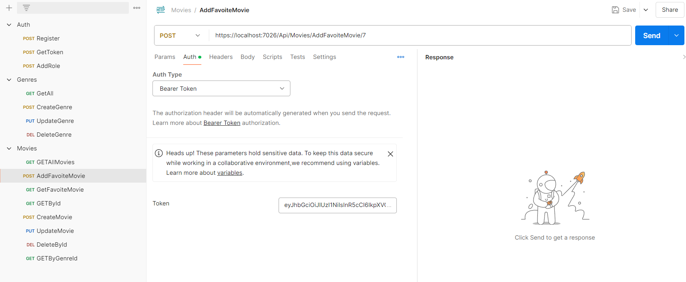

# Movies-API
This project is an exercise to apply what I have learned about .NET Technology. I used C#,SQL Server, EF Core, LINQ, .NET API, Identity, JWT Berar token.




## Table of Contents

1. [Roles](#roles)
2. [Movie](#movie)
3. [Genre](#genre)

## Roles
There are two roles in this app, User and Admin. 
User can GET all movies, GET a movie by id, GET movies by a genre id, Add a favorite movie, Get favorite movies and Get all genres.
Admin can create a movie, update a movie, delete a movie by id, create a genre, update a genre, delete a genre and add role for users.

## Movie
```C#
public class Movie
{
    public int Id { get; set; }
    public string Title { get; set; }
    public int Year { get; set; }
    public double Rate { get; set; }
    public string StoryLine { get; set; }
    public byte[] Poster { get; set; }
    public string Author { get; set; }
    public byte GenreId { get; set; }
    public Genre Genre { get; set; }

}
```
## Genre
```C#
public class Genre
{
    public byte Id { get; set; }
    public string Name { get; set; }
}
```

